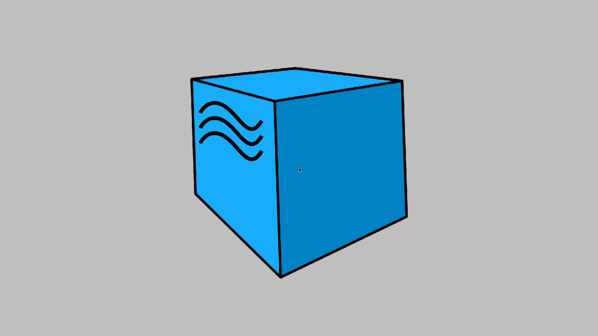
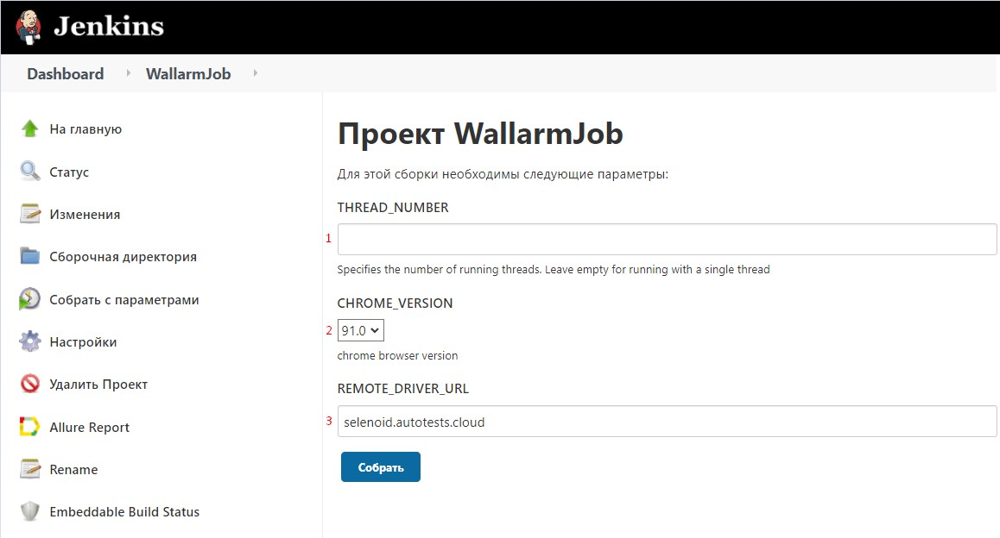
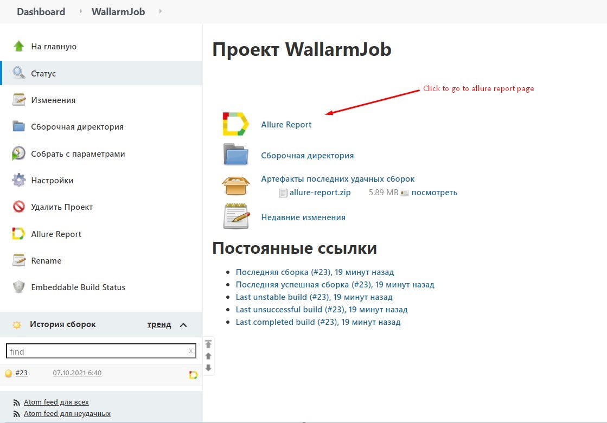
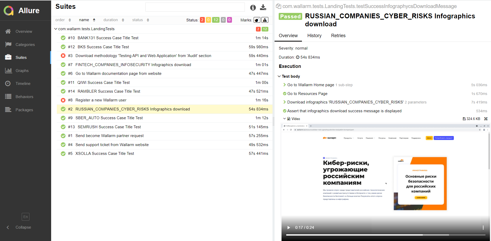
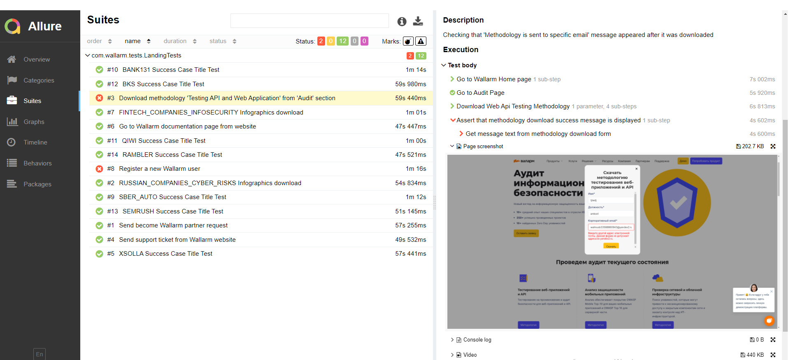
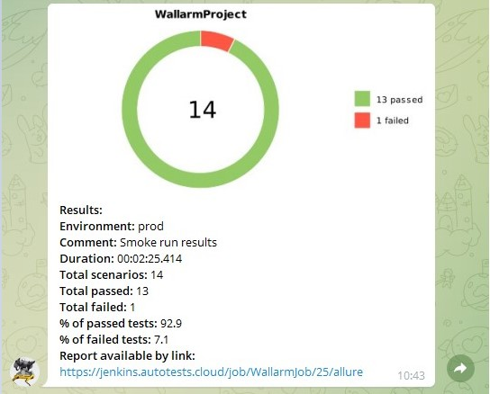

  
 

# 
   Autotests for [Wallarm: Web application and API protection platform](https://www.wallarm.ru/) website

___
##  
 Technologies and tools used 

| IntelliJ IDEA | Gradle | Java | Junit5 | Selenide | Selenoid | Jenkins | Allure Report | Allure TestOps | Telegram (notifications) |
|:------:|:----:|:----:|:------:|:------:|:--------:|:--------:|:-------------:|:---------:|:-------:|
|  |  |  |  |  |  |  |  |  |  |

___
## The following test cases have been implemented:

1. New Wallarm user registration and navigating to personal account from confirmation letter
2. Sending support request from Wallarm website
3. Проверка получения сообщения об отправке методологии на указанный емейл после ее скачивания "Услуги"
4. Sending become Wallarm partner request
5. Navigate to Wallarm documentation page from website
6. **(Parameterized)** Go to success case page
7. **(Parameterized)** Checking "Infographycs has been sent to an email" message is displayed when download an Infographycs 
* Parameterized - a parameterized test for executing the same scenario using different set of entries 

___

## Example of test execution in [**Selenoid environment**](https://selenoid.autotests.cloud/#/)

___

## Running from [**Jenkins**](https://jenkins.autotests.cloud/job/WallarmJob/build?delay=0sec)
To start the build you need to specify the following parameters:

* **THREAD_NUMBER** - Specifies the number of concurrent running threads. Leave empty for running with a single thread
* **CHROME_VERSION** - Chrome version for Selenoid environment
* **REMOTE_DRIVER_URL** - Host address for Selenoid

Allure report with test execution results will be generated automatically after build completion  

For more detailed information on a test, click on its name in the list. In the opened tab you can find a list of the test's execution steps and the video attachment of its whole run at the bottom. If the test marked as failed, a screenshot of its failure and browser console logs will also be attached.

___
## Telegram notifications
A telegram notification with test execution results will be sent in a pre-configured channel after build completion

