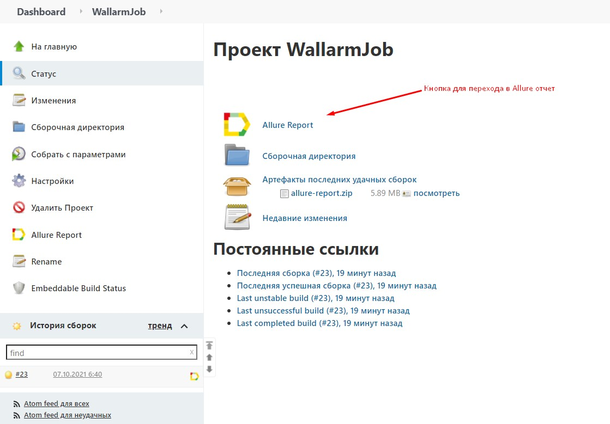

# 
   Autotests for [Wallarm: Web application and API protection platform](https://www.wallarm.ru/) website

___
##  
 Technologies and tools used 

| IntelliJ IDEA | Gradle | Java | Junit5 | Selenide | Selenoid | Jenkins | Allure Report | Allure TestOps | Telegram (notifications) |
|:------:|:----:|:----:|:------:|:------:|:--------:|:--------:|:-------------:|:---------:|:-------:|
|  |  |  |  |  |  |  |  |  |  |

___
## The following test cases have been implemented:

1. New Wallarm user registration с переходом в ЛК из письма-подтверждения
2. Sending support request from Wallarm website
3. Проверка получения сообщения об отправке методологии на указанный емейл после ее скачивания "Услуги"
4. Sending become Wallarm partner request
5. Go to Wallarm documentation page from website
6. **(Parameterized)** Go to success case page
7. **(Parameterized)** Checking "Infographycs has been sent to an email" message is displayed when download an Infographycs 
* Parameterized - a parameterized test to execute the same scenario using different set of entries 

___

## Example of test execution in [**Selenoid environment**](https://selenoid.autotests.cloud/#/)

___

## Running from [**Jenkins**](https://jenkins.autotests.cloud/job/WallarmJob/build?delay=0sec)
To start the build you need to specify the following parameters:

* **THREAD_NUMBER** - Specifies the number of concurrent running threads. Leave empty for running with a single thread
* **CHROME_VERSION** - Chrome version for Selenoid environment
* **REMOTE_DRIVER_URL** - Selenoid host address

Allure report will be generated automatically after build completion  
После завершения выполнения сборки будет сформирован Allure-отчет, при переходе в который отобразится результат выполнения всех тестовых сценариев.

Для получения более детальной информации необходимо нажать на интересующий тестовый сценарий. В появившейся вкладке отобразятся шаги выполнения теста и также будет прикреплено видео с его прохождением, а в случае если тест завершился падением, то дополнительно будет прикреплен скриншот и лог из консоли браузера.

___
## Telegram-оповещения
После завершения выполнения сборки будет отправлено оповещение в предварительно настроенный telegram-канал с результатами прохождения тестов

